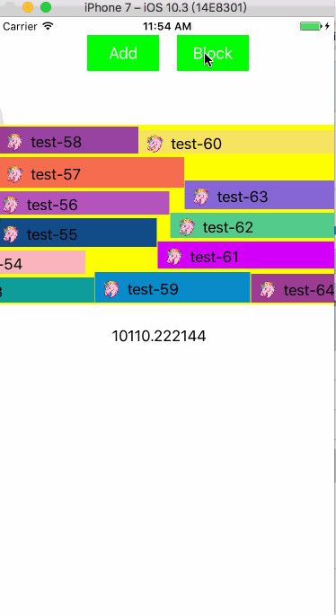

DanmakuKit
===
Simple Danmaku Engine for iOS inspired by [BarrageRenderer](https://github.com/unash/BarrageRenderer)



## Usage

初始化
```
DanmakuRenderer *renderer = [[DanmakuRenderer alloc] init];
renderer.view.frame = CGRectMake(0, 120, 375, 200);
renderer.danmakuVerticalAlignment = DanmakuVerticalAlignmentBottom;
renderer.danmakuMoveDirection = DanmakuMoveDirectionRightToLeft;
[self.view addSubview:renderer.view];
[renderer start];
```

发弹幕
```
MyViewModel *viewModel = [MyViewModel new];
viewModel.text = @"text danmaku";
DanmakuSprite *danmaku = [DanmakuSpriteFactory createDanmakuWithViewClass:NSStringFromClass([MyDanmakuView class])
                                                                viewModel:viewModel];
[self.danmakuRender accept:danmaku];
```

## Features

- [x] 支持弹幕从左到右和从右到左滑动
- [x] 支持弹幕居上对齐和局下对齐
- [x] 支持自定义滑动速度
- [x] 支持自定义弹幕UI
- [x] 支持弹幕点击

## Author

zhudongfang0312@gmail.com
